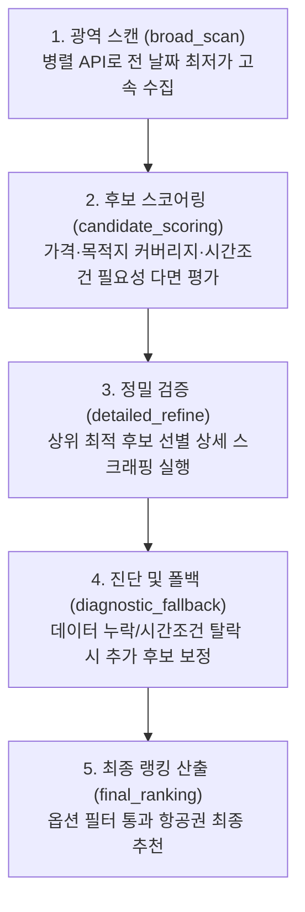

# ✈️ Korea Flights (`korea-flights`)

[](https://www.python.org/)
[](https://opensource.org/licenses/MIT)
[](SKILL.md)
[](tests/)
[](src/korea_flights/strategy.py)

> **인터파크 항공(Interpark) 기반 초고속 국내선·국제선 항공권 검색, 최적 날짜·목적지 탐색 및 실시간 가격 감시 Python 패키지 & OpenClaw 에이전트 스킬**

`korea-flights`는 대화형 AI 에이전트(OpenClaw) 및 파이썬 CLI 환경에서 **국내선(김포·제주·부산 등)과 국제선(일본·동남아 등)** 최저가 항공권을 신속하고 정확하게 탐색할 수 있도록 설계된 도구입니다.

기존 대규모 브라우저 스크래퍼의 느린 속도를 개선하기 위해, **광역 API 탐색(`broad_scan`)**과 **상세 검증(`detailed_refine`)**을 결합한 독자적인 **5단계 하이브리드 전략 엔진**을 탑재하였습니다.

---

## 📌 목차 (Table of Contents)
- [✨ 핵심 기능 한눈에 보기](#-핵심-기능-한눈에-보기)
- [🚀 빠른 시작 (Quick Start)](#-빠른-시작-quick-start)
- [⚙️ 시스템 구조 및 런타임 연동 (Architecture)](#️-시스템-구조-및-런타임-연동-architecture)
- [🔍 상세 사용법 및 실전 예제](#-상세-사용법-및-실전-예제)
  - [1. 단일 노선 검색 (`search`)](#1-단일-노선-검색-search)
  - [2. 최적 날짜 범위 검색 (`range`)](#2-최적-날짜-범위-검색-range)
  - [3. 다구간·다목적지 매트릭스 검색 (`matrix`)](#3-다구간다목적지-매트릭스-검색-matrix)
  - [4. 정밀 필터링 (직항, LCC/FSC, 가격대, 시간대)](#4-정밀-필터링-직항-lccfsc-가격대-시간대)
- [🔔 스마트 가격 감시 및 알림 (`alert`)](#-스마트-가격-감시-및-알림-alert)
- [🧠 5단계 하이브리드 전략 엔진 구조](#-5단계-하이브리드-전략-엔진-구조)
- [🤖 OpenClaw AI 에이전트 연동 가이드](#-openclaw-ai-에이전트-연동-가이드)
- [📋 CLI 명령어 및 옵션 치트시트](#-cli-명령어-및-옵션-치트시트)
- [🩺 자가 진단 및 테스트 (`doctor`, `live-smoke`)](#-자가-진단-및-테스트-doctor-live-smoke)
- [📂 프로젝트 구조 및 참조 레퍼런스](#-프로젝트-구조-및-참조-레퍼런스)
- [⚠️ 주의사항 및 문제 해결 (FAQ)](#️-주의사항-및-문제-해결-faq)

---

## ✨ 핵심 기능 한눈에 보기

| 기능 구분 | 주요 제공 내용 |
| :--- | :--- |
| **자연어 친화적 입력** | "김포", "제주", "간사이", "내일", "다음주말", "복귀 18시 이후", "저녁" 등 한/영 별칭 완벽 인식 |
| **초고속 하이브리드 검색** | 전체 일정 빠른 스캔 후 가치 높은 후보군만 선별 상세 조회하여 탐색 시간 80% 단축 |
| **다목적지·다일자 매트릭스** | "김포발 제주·부산·여수 중 다음 주말 최저가", "도쿄·오사카·후쿠오카 7일간 비교" 일괄 처리 |
| **풍부한 항공 필터** | 직항만(`--nonstop-only`), 저비용/대형항공사(`--airline LCC\|FSC`), 최대 경유수, 실질가 예산 범위 |
| **타깃 가격 자동 감시** | 지정한 목표가 이하 발견 시 자동 브리핑, 중복 알림 방지(`dedupe`), 사용자 템플릿 지원 |
| **표준 계약 출력** | 터미널 친화적 한글 요약(`--human`) 및 AI/파이프라인 연동용 구조화 JSON(`--json`) 동시 지원 |

---

## 🚀 빠른 시작 (Quick Start)

### 1. 패키지 설치
Python 3.10 이상 환경에서 설치합니다.

```bash
# 개발 모드 설치
git clone https://github.com/twbeatles/openclaw-korea-domestic-flights.git
cd openclaw-korea-domestic-flights
python -m pip install -e .[dev]
```

### 2. 소스 저장소 연동 확인 (`doctor`)
본 패키지는 스크래핑 엔진인 `Scraping-flight-information`과 어댑터로 통신합니다.

```bash
korea-flights doctor --repo-path "D:\twbeatles-repos\Scraping-flight-information"
```
> 환경 변수 `KDF_SOURCE_REPO`에 경로를 등록해두면 `--repo-path` 인수를 매번 입력할 필요가 없습니다.

### 3. 첫 검색 실행
```bash
# 내일 김포에서 제주로 가는 가장 저렴한 항공편 조회
korea-flights search --origin 김포 --destination 제주 --departure 내일 --human
```

---

## ⚙️ 시스템 구조 및 런타임 연동 (Architecture)

`korea-flights`는 스크래핑 엔진을 자체에 중복 복제하지 않고, 모듈화된 어댑터([`FlightSourceAdapter`](file:///c:/twbeatles-repos/korea-domestic-flights-skill/src/korea_flights/source.py))를 통해 외부 스크래퍼와 연결됩니다.


### 런타임 탐색 순서
`korea-flights`는 스크래퍼 위치를 다음 우선순위로 자동 감지합니다:
1. CLI 옵션: `--repo-path <PATH>`
2. 환경 변수: `KDF_SOURCE_REPO`
3. 환경 변수: `SCRAPING_FLIGHT_INFORMATION_REPO`
4. 상대 경로: `./tmp/Scraping-flight-information` 또는 `../tmp/Scraping-flight-information`
5. 상대 경로: `./Scraping-flight-information` 또는 `../Scraping-flight-information`

> **Tip (권장):** Windows 환경 변수 등록
> ```powershell
> [Environment]::SetEnvironmentVariable("KDF_SOURCE_REPO", "D:\twbeatles-repos\Scraping-flight-information", "User")
> ```

---

## 🔍 상세 사용법 및 실전 예제

### 1. 단일 노선 검색 (`search`)
특정 출발일/귀국일의 국내선 및 국제선 항공편을 조회합니다.

```bash
# [국내선] 내일 김포 -> 제주 편도 검색 (사람이 읽기 편한 포맷)
korea-flights search --origin 김포 --destination 제주 --departure 내일 --human

# [국제선] 인천 -> 도쿄 나리타 편도 검색 (JSON 데이터 출력)
korea-flights search --origin ICN --destination NRT --departure 내일 --scope international --json

# [왕복+승객] 2026-10-01 출발, 2026-10-04 복귀, 성인 2명 + 소아 1명
korea-flights search --origin ICN --destination KIX --departure 2026-10-01 --return-date 2026-10-04 --adults 2 --child 1 --human
```

---

### 2. 최적 날짜 범위 검색 (`range`)
일정 범위(기본 최대 45일) 내에서 가장 저렴한 출발/복귀 날짜 조합을 탐색합니다.

```bash
# 다음 주말 오사카행 항공편 최저가 탐색
korea-flights range --origin ICN --destination KIX --date-range "다음주말" --scope international --human

# 6월 1일부터 6월 15일까지, 2박 3일(return-offset 2) 일정 중 '복귀 18시 이후' 조건 탐색
korea-flights range --origin 김포 --destination 제주 \
  --start-date 2026-06-01 --end-date 2026-06-15 \
  --return-offset 2 --time-pref "복귀 18시 이후" --human
```

---

### 3. 다구간·다목적지 매트릭스 검색 (`matrix`)
어디로 갈지 정하지 못했을 때 여러 도시와 날짜를 동시에 비교합니다 (기본 최대 120조합).

```bash
# 일본 주요 도시(도쿄, 오사카, 후쿠오카) 7일간 최저가 일괄 비교
korea-flights matrix --origin ICN --destinations NRT,KIX,FUK --date-range "내일부터 7일" --scope international --human

# 국내 휴양지(제주, 부산, 여수) 다음 주말 2박3일 최저가 비교
korea-flights matrix --origin 김포 --destinations 제주,부산,여수 --date-range "다음주말" --return-offset 2 --human
```

---

### 4. 정밀 필터링 (직항, LCC/FSC, 가격대, 시간대)
불필요한 경유편이나 예산 초과 항공편을 사전에 차단합니다.

```bash
# 삿포로(CTS) 직항편만 검색
korea-flights search --origin ICN --destination CTS --departure 내일 --nonstop-only --human

# 오사카(KIX) LCC(저비용항공사) 중 20만 원 이하 실질가만 검색
korea-flights search --origin ICN --destination KIX --departure 내일 --airline LCC --max-price 200000 --human

# 캐시를 무시하고 실시간 강제 재조회 (Ctrl+Shift+Enter 효과)
korea-flights search --origin ICN --destination TPE --departure 내일 --force-refresh --human
```

#### 💡 자연어 날짜 및 시간 키워드 가이드
- **날짜 표현**: `오늘`, `내일`, `모레`, `이번주말`, `다음주말`, `다음주 월요일`, `내일부터 7일`, `2026-10-01~2026-10-05`
- **시간 표현 (`--time-pref`)**: `저녁`, `오전`, `오후`, `출발 10시 이후`, `복귀 18시 이후`, `늦은 시간 선호`
- **공항 표현**: `김포`, `제주`, `부산`, `나리타`, `간사이`, `후쿠오카`, `다낭`, `방콕`, `TPE`, `CTS` 등 (대소문자/한영 무관)
- *더 많은 키워드 목록은 [references/search-keywords.md](references/search-keywords.md)를 참고하세요.*

---

## 🔔 스마트 가격 감시 및 알림 (`alert`)

원하는 노선과 조건에 목표 가격을 설정해두고, 가격이 떨어졌을 때 알림을 받습니다.

```bash
# 1. 감시 규칙 등록 (김포-제주 다음주말 2박3일 15만원 이하 & 복귀 18시 이후)
korea-flights alert add --origin 김포 --destination 제주 \
  --date-range "다음주말" --return-offset 2 \
  --target-price 150000 --time-pref "복귀 18시 이후"

# 2. 감시 규칙 등록 (인천-삿포로 LCC 직항 20만원 이하)
korea-flights alert add --origin ICN --destination CTS \
  --departure 내일 --target-price 200000 --nonstop-only --airline LCC

# 3. 등록된 규칙 목록 확인
korea-flights alert list

# 4. 가격 점검 실행 (목표가 충족 시 알림 출력, 중복 알림 자동 방지)
korea-flights alert check

# 5. 중복 방지 무시하고 즉시 강제 점검
korea-flights alert check --no-dedupe
```

---

## 🧠 5단계 하이브리드 전략 엔진 구조

`HybridStrategyEngine`([`src/korea_flights/strategy.py`](file:///c:/twbeatles-repos/korea-domestic-flights-skill/src/korea_flights/strategy.py))은 광범위한 날짜/목적지 탐색 시 시간과 비용을 최적화하기 위해 고안된 파이프라인입니다.



1. **`broad_scan`**: `ParallelSearcher`를 통해 수십 일치 항공권의 최저가 지표를 순식간에 훑어옵니다.
2. **`candidate_scoring`**: 가격 경쟁력, 목적지 분배, 인접일 저가 추세, 시간 선호 부합 가능성을 종합 점수화합니다.
3. **`detailed_refine`**: 점수가 높은 핵심 후보군(`--refine-budget`, 기본 8개)만 `FlightSearcher`로 상세 편명, 출발/도착 시각, 좌석 잔여를 확인합니다.
4. **`diagnostic_fallback`**: 상세 조회 시 시간 조건 탈락이나 정보 누락이 발생하면 폴백 예산(`--fallback-budget`, 기본 6개)을 투입해 추가 후보를 검증합니다.
5. **`final_ranking`**: 직항, 항공사(LCC/FSC), 가격 및 시간 조건을 모두 충족하는 신뢰도 높은 항공편만 최종 브리핑합니다.

---

## 🤖 OpenClaw AI 에이전트 연동 가이드

`korea-flights`는 [OpenClaw](SKILL.md) AgentSkill 규격을 기본 지원합니다. AI 어시스턴트가 사용자의 자연어 요청을 해석하여 도구를 호출할 수 있습니다.

### OpenClaw 스킬 등록
OpenClaw 설정에 본 저장소를 스킬로 포함하면 AI가 아래와 같은 질의에 자동으로 CLI 명령을 조합하여 응답합니다.

> 💬 **사용자**: "다음 주말에 부산에서 제주도 가는 LCC 직항 편도 7만 원 이하로 알아봐 줘."  
> 🤖 **Agent 실행**:  
> `korea-flights search --origin PUS --destination CJU --date-range "다음주말" --airline LCC --nonstop-only --max-price 70000 --json`

### 표준 JSON 응답 계약 (Contract)
`--json` 플래그 사용 시 AI 파싱에 최적화된 일관된 구조를 반환합니다:

```json
{
  "status": "success",
  "query": {
    "origin": "GMP",
    "destination": "CJU",
    "departure_date": "2026-10-01",
    "filters": {
      "airline": "LCC",
      "nonstop_only": true,
      "max_price": 70000
    }
  },
  "summary": {
    "best_option": {
      "airline": "이스타항공",
      "airline_category": "LCC",
      "flight_number": "ZE209",
      "departure_time": "08:15",
      "arrival_time": "09:25",
      "price": 50800,
      "effective_price": 50800,
      "stops": 0
    }
  },
  "results": [ ... ],
  "strategy_metadata": { "refine_count": 8, "filter_active": true },
  "diagnostics": { "status": "ok" }
}
```

---

## 📋 CLI 명령어 및 옵션 치트시트

### 서브커맨드 목록
- `korea-flights search`: 단일 노선 편도/왕복 상세 검색
- `korea-flights range`: 날짜 범위(최대 45일) 최저가 탐색
- `korea-flights matrix`: 다수 목적지 × 날짜(최대 120개) 매트릭스 탐색
- `korea-flights alert`: 타깃 가격 감시 규칙 관리 (`add`, `list`, `check`, `remove`, `render`)
- `korea-flights doctor`: 로컬 스크래퍼 소스 연동 및 임포트 상태 점검
- `korea-flights live-smoke`: 라이브 환경 얕은 검증 스모크 테스트

### 공통 옵션 요약
| 옵션 | 기본값 | 설명 |
| :--- | :--- | :--- |
| `--origin` | *(필수)* | 출발 공항 (코드, 한글명, 영문명) |
| `--destination` / `--destinations` | *(필수)* | 도착 공항 (단일 또는 콤마 구분 다수) |
| `--departure` / `--return-date` | - | 출발일 / 귀국일 (자연어 또는 YYYY-MM-DD) |
| `--date-range` | - | "다음주말", "내일부터 7일" 등 범위 지정 |
| `--scope` | `auto` | `auto`, `domestic`(국내선), `international`(국제선) |
| `--airline` | - | 항공사 그룹 필터: `all`, `LCC`, `FSC` |
| `--nonstop-only` | `false` | 직항 항공편만 결과에 포함 |
| `--max-stops` | - | 허용 최대 경유 횟수 (0=직항, 1=1회 경유 등) |
| `--min-price` / `--max-price` | - | 실질가(혜택가 적용 기준) 최소/최대 예산 범위 (원) |
| `--time-pref` | - | 시간대 선호 ("저녁", "복귀 18시 이후" 등) |
| `--adults` / `--child` / `--infant` | `1 / 0 / 0` | 승객 수 (성인 1~9, 소아 0~9, 유아 0~9) |
| `--force-refresh` | `false` | 검색 캐시를 무시하고 인터파크 실시간 재조회 |
| `--human` / `--json` | - | 콘솔 요약 출력 / 기계 판독용 JSON 출력 |

---

## 🩺 자가 진단 및 테스트 (`doctor`, `live-smoke`)

### 1. 환경 및 모듈 연동 점검
```bash
# 기본 파일 및 폴더 구조 검사
korea-flights doctor

# 실제 Python 임포트 가능 여부까지 정밀 점검
korea-flights doctor --import-check
```

### 2. 라이브 스모크 테스트
스크래핑 라이브 소스에서 국내선(`GMP→CJU`) 및 국제선(`ICN→NRT`) 쿼리가 정상 응답하는지 점검합니다:
```bash
korea-flights live-smoke --json
```

### 3. 유닛 및 통합 테스트 실행
```bash
# 전체 테스트 실행
python -m pytest -q

# 구문 및 타입 컴파일 검증
python -m compileall src scripts tests
```

---

## 📂 프로젝트 구조 및 참조 레퍼런스

```
korea-domestic-flights-skill/
├── src/
│   └── korea_flights/
│       ├── airlines.py       # LCC/FSC 항공사 분류 및 실질가 산정 로직
│       ├── airports.py       # 공항 코드 정규화, 도시 매핑, 노선 판별
│       ├── alerts.py         # 가격 감시 규칙 스토어 및 알림 렌더링
│       ├── cli.py            # CLI 엔트리포인트 및 서브커맨드 파서
│       ├── dates.py          # 자연어 날짜 파서 및 범위 생성기
│       ├── diagnostics.py    # 검색 실패 진단 및 힌트 생성
│       ├── formatting.py     # 터미널 Human-readable 및 JSON 포맷터
│       ├── source.py         # 외부 스크래퍼(Scraping-flight-information) 어댑터
│       ├── strategy.py       # 5단계 HybridStrategyEngine 핵심 구현부
│       └── timeprefs.py      # 시간대 선호 및 필터 처리기
├── references/
│   ├── domestic-airports.md      # 국내선 지원 공항 코드 및 한글/영문 매핑표
│   ├── international-airports.md # 국제선 주요 공항/도시 코드 매핑표
│   ├── search-keywords.md        # 자연어 검색 키워드 사전
│   └── price-alerts-schema.md    # 가격 감시 JSON 스키마 정의
├── tests/                        # 회귀 및 단위 테스트 스위트
├── pyproject.toml                # 패키지 빌드 명세 및 의존성
└── SKILL.md                      # OpenClaw 에이전트 스킬 명세서
```

---

## ⚠️ 주의사항 및 문제 해결 (FAQ)

> [!IMPORTANT]
> **외부 스크래퍼 의존성**:  
> 본 패키지는 독립된 Python 패키지이지만, 실제 항공권 데이터를 가져오기 위해 로컬 `Scraping-flight-information` 런타임이 필요합니다. 연동 오류 시 `korea-flights doctor`로 필요한 4개 핵심 파일(`searcher.py`, `parallel.py`, `models.py`, `scraper_config.py`) 존재 여부를 확인하세요.

> [!WARNING]
> **과도한 반복 조회 주의**:  
> 자동 감시 스케줄링 시 과도하게 짧은 주기로 요청할 경우 공급자(인터파크 및 항공사)에 의해 일시적 IP 차단 또는 지연이 발생할 수 있습니다. 15~30분 이상의 주기를 권장합니다.

> [!NOTE]
> **실질가(`effective_price`) 기준 정렬**:  
> 카드사 할인 및 프로모션 혜택이 있는 경우 기본가(`price`) 대신 혜택가(`benefit_price`)를 고려한 최저 실질가를 기준으로 필터링 및 정렬이 수행됩니다.

---

## 🏷️ GitHub Topics & SEO Tags

`flight-search` · `korea-flights` · `openclaw` · `openclaw-skill` · `interpark-flight` · `playwright` · `lcc-finder` · `cheapest-flights` · `korea-travel` · `price-alerts` · `항공권-최저가` · `국내선-항공권` · `제주도-항공권` · `일본-항공권`
